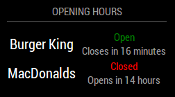

# MMM-OpeningHours - WIP


**Note! This module is still under development! 
Things such as configurations and appearance may change. Use at your own risk!**

Magic Mirror module that displays places opening hours.
Relies on [Google Places API](https://developers.google.com/places/web-service/intro).

## Screenshot


## Prerequisite

You need to have a Google Places API key to use this module. 
Follow their guide here: [Get API Key](https://developers.google.com/places/web-service/get-api-key).

**NOTE! The opening hours field in Google Places API is a billed field. 
However, Google give you a free monthly credit. 
Please carefully read about their billing [here](https://developers.google.com/places/web-service/usage-and-billing).
Contributors of this module is not responsible for any charges.**

## Install
This module uses Yarn.
1. `yarn install`

## Find places ID
Search for the place to get its ID. You really needs to **search** for a place. Clicking on a place wont cut it.

[Place ID Finder](https://google-developers.appspot.com/maps/documentation/javascript/examples/full/places-placeid-finder)

## Configuration

| Key          | Value             | Required | Default           | Description                                                                                                                                                                                             |
|--------------|-------------------|----------|-------------------|---------------------------------------------------------------------------------------------------------------------------------------------------------------------------------------------------------|
| googleApiKey | _string_          | Yes      | N/A               | Your Google Places API Key.                                                                                                                                                                             |
| places       | _place id_        | Yes      | N/A               | List of place ids. [See above.](#find-places-id)                                                                                                                                                        |
| scheduleTime | _milliseconds_    | No       | 86400000 (24h)    | Time between fetching place data from Google.                                                                                                                                                           |
| timeFormat   | _number_          | No       | config.timeFormat | 24h, 12h. If not specified, uses same as parent config.                                                                                                                                                 |
| language     | _ISO 639-1  code_ | No       | config.language   | Changes the translation. Time and date is still locale. Two letter country code. [ISO 639-1 code](https://en.wikipedia.org/wiki/List_of_ISO_639-1_codes). If not specified, uses same as parent config. |
| styling      | _object_          | No       | See next table.   | Configure table style.
| debug        | _boolean_         | No       | false             | Debug output.                                                                                                                                                                                           |
| mockData     | _boolean_         | No       | false             | Fake API-call. Used for development.                                                                                                                                                                    |

#### Styling

| Key           | Value     | Required | Default         | Description                                                           |
|---------------|-----------|----------|-----------------|-----------------------------------------------------------------------|
| showTimeUntil | _boolean_ | No       | true            | Show time until close/open instead of time when closed/open.          |
| textAlign     | _string_  | No       | center          | Table text alignment. Possible values: left, right, center.           |
| size          | _string_  | No       | small           | Size of table. Possible values: xsmall, small, medium. large, xlarge. |
| header        | _object_  | No       | See next table. | Configure header style.                                               |

##### Header
| Key       | Value     | Required | Default | Description                                                           |
|-----------|-----------|----------|---------|-----------------------------------------------------------------------|
| show      | _boolean_ | No       | true    | Show header.                                                          |
| size      | _string_  | No       | xsmall  | Size of header. Possible values: xsmall, small, medium. large, xlarge |
| textAlign | _string_  | No       | center  | Header text alignment. Possible values: left, right, center.          |


## Example config

```
{
    module: "MMM-OpeningHours",
    position: "bottom_right",
    config: {
    googleApiKey: "XXXXXXXXXXXXXX",
        places: ["xxxxxxxx", "yyyyyyyy"],
        styling: {
          size: 'small',
          header: {
            size: 'xsmall',
          }
        }
    }
}
```
## Development
This module isn't perfect. If you find a bug or has a feature request don't hesitate to create an issue OR even better, create a pull request! :D